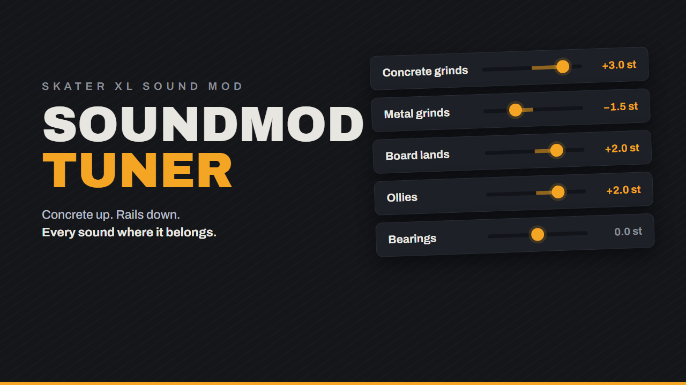

# SoundModTuner



Batch tuning tools for Skater XL sound mod packs, built on ffmpeg. Pitch, EQ and
level per sound category, while leaving menu (UI) and bail (Ragdoll) sounds
untouched and keeping every file's format (codec, sample rate, channels, bit
depth) and filename intact, so the output is a drop-in replacement mod.

## Install

1. Download this repo (**Code → Download ZIP**, or `git clone`) and unzip it
   anywhere. No installer, no admin rights.
2. Put your Skater XL sound pack in a folder named `Sounds` next to the
   scripts, so you end up with `Sounds\board_land0.wav` and friends. **Sound
   packs are not included here** — bring your own.
3. Double-click `Launch SoundModTuner.bat`.

On first launch, if [ffmpeg](https://ffmpeg.org) isn't already on your machine,
a portable build downloads automatically (~170 MB, one time) into a local `bin`
folder. Nothing touches your system PATH. Already have ffmpeg? It's used as-is
and nothing is downloaded.

Your unzipped folder should look like this:

```
SoundModTuner\
  Launch SoundModTuner.bat
  SoundModTuner.ps1
  AudioChain.ps1
  Process-SoundMod.ps1
  bootstrap-ffmpeg.ps1
  Sounds\              <- you add this
  bin\                 <- created on first launch, if needed
  Sounds_processed\    <- created when you hit Process All
```

### Requirements

- Windows 10/11 — stock Windows PowerShell 5.1, nothing to install
- Internet on first launch only, and only if you don't already have ffmpeg

## SoundModTuner.ps1 — per-category GUI

Double-click `Launch SoundModTuner.bat` (or run
`powershell -ExecutionPolicy Bypass -File .\SoundModTuner.ps1`, adding
`-Source "C:\path\to\Sounds"` if your pack lives elsewhere).
A local browser page opens with one row per sound category.

Each row has a pitch slider, and expands (`▸`) into an FX box:

- **EQ** — 5 bands on a draggable curve: a low shelf, three peaking bands and a
  high shelf, ±12 dB. Drag a point to set frequency and gain, scroll for Q,
  double-click a point to flatten it. The drawn curve is computed from the same
  biquads ffmpeg will apply, so it's the response you actually get.
- **Volume** — a per-category trim, −18 to +6 dB.

**Preview** renders a real sample through the ffmpeg pipeline and plays it;
**A/B** flips instantly between processed and original at the same position, and
the sample line reports the peak in dBFS. Long files (rolling, bearings, grind
loops run 10–32 s) preview as a 4 s excerpt from the middle. `↻` picks a
different sample. **Copy FX from…** shares EQ and level between categories
without touching their pitch.

**Process All** builds `Sounds_processed` with live progress. Categories left at
their defaults are copied bit-for-bit rather than re-encoded; excluded folders
(`UI`, `Ragdoll`) are always copied untouched. Settings persist to
`tuner-settings.json`.

The server listens on `http://localhost:8977` (falls back to the next free port)
and only accepts local connections. Close the terminal window or use the Quit
button to stop it.

### No normalization, on purpose

The game's mix depends on categories sitting at deliberately different levels —
bearings quieter than rolling, and so on. Peak-normalizing every sample to a
common ceiling flattens exactly the relationships that make it read as a real
skateboard, so it was removed in v1.2. Levels are set by hand with the volume
trim, and the peak readout on preview tells you where each category actually
sits.

The one piece of automatic gain is the **clip guard**. Once you can boost with
EQ and volume, it is easy to push a file past 0 dBFS and get digital distortion
in-game with no warning. The guard measures the true peak of the finished chain
and applies only enough attenuation to land at −0.3 dBFS. It never boosts and
never moves categories toward each other, so the mix you dialled in is
preserved — it only catches files that would otherwise clip, and says so.

### No reverb (yet)

ffmpeg has no real reverb. A version built on chained `aecho` stages was tried
and cut — with only ~16 discrete taps it reads as a multi-tap delay, not a
space. Better to have no reverb than a bad one; a proper plugin can be wired in
later.

Two constraints for whenever that happens, both learned the expensive way:

- **A reverb tail lengthens the file**, and 35 files in the pack are loops the
  game repeats itself (`*_loop*`, plus all of rolling and bearings, running
  3.4–32 s). Appending a tail puts a discontinuity at the loop point. Either
  skip those files, or wrap the tail around by rendering several loop
  iterations and keeping the last one.
- **Reverb does little on sustained sounds anyway.** It reads as space because
  of how it decays *after a transient*; on stationary material like a grind
  loop the delayed copies are perceptually the same noise, so you get comb
  filtering and a level bump. The files where a tail breaks the loop are the
  same ones where it buys nothing.

Nothing in the current chain changes file length: varispeed scales it uniformly
and EQ/volume are sample-for-sample. Loops stay seamless.

## Process-SoundMod.ps1 — global CLI

One pitch value for every board sound, no per-category control:

```powershell
.\Process-SoundMod.ps1 -Semitones 2             # +2 st
.\Process-SoundMod.ps1 -Semitones 2 -Limit 1    # quick single-file test
```

`-Semitones` accepts −5 to +5 (decimals allowed).

## How the pitch shift works

Varispeed via ffmpeg `asetrate`/`aresample` — pitch and length change together,
which sounds natural on percussive one-shots (+2 st shortens a sample ~11%).
Originals are never modified; everything is written to `Sounds_processed`.

## Files

| File | Purpose |
|---|---|
| `SoundModTuner.ps1` | The GUI, HTTP server, and batch runner |
| `AudioChain.ps1` | Filter-chain construction and clip guard — shared by the preview and render paths so they cannot drift |
| `Process-SoundMod.ps1` | Global pitch-only CLI |
| `bootstrap-ffmpeg.ps1` | First-launch portable ffmpeg download |
| `tuner-settings.json` | Saved per-category settings (v1 files migrate automatically) |

## How the audio chain works

`AudioChain.ps1` builds one ffmpeg filter string per category, in a fixed order: **pitch, then EQ,
then volume**. Pitch is a resample (`asetrate`, then back to the file's own rate), EQ is five biquads
(low shelf, three peaking `equalizer` bands, high shelf) and volume sits last so the slider is a pure
trim. The browser UI draws its EQ curve from the same biquad coefficients, so the curve on screen is
the response ffmpeg applies. Peaks are measured with `astats` on a float pipeline, because
`volumedetect` clamps at 0 dBFS and would hide an overshoot. Design notes: [`docs/design.md`](docs/design.md).

## Licence

MIT, see LICENSE. Sound packs are not included and keep their own licences.
